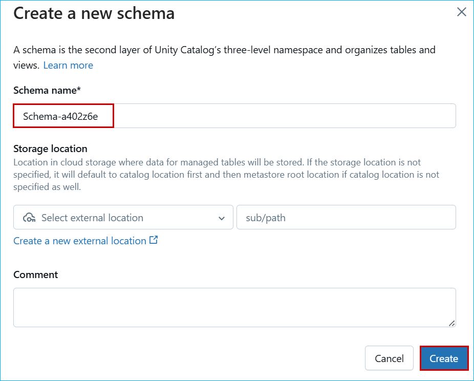
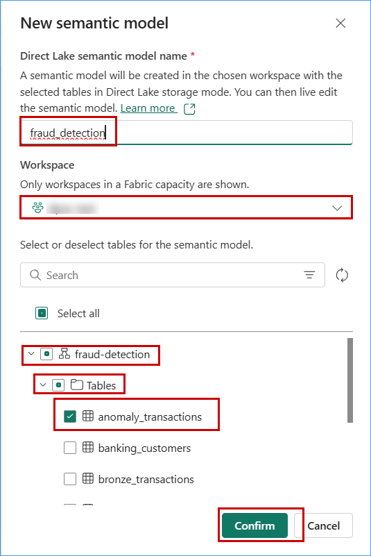

# Replacement Tokens & Values

* Storage Account Key: `@lab.Variable(storageaccountkey)`
* SQL Endpoint: `@lab.Variable(sqlEndpoint)`
* Destination URI: `@lab.Variable(destinationUri)`
* Workspace URL: `@lab.Variable(workspaceurl)`
* Event Hub key: `@lab.Variable(EventHubKey)`

# ignite25-LAB335-analytics-and-ai-with-azure-databricks-ai-foundry-and-copilot
**The estimated time to complete this lab is 50-60 minutes.**

**DISCLAIMER**

This presentation, demonstration, and demonstration model are for informational purposes only and (1) are not subject to SOC 1 and SOC 2 compliance audits, and (2) are not designed, intended or made available as a medical device(s) or as a substitute for professional medical advice, diagnosis, treatment or judgment. Microsoft makes no warranties, express or implied, in this presentation, demonstration, and demonstration model. Nothing in this presentation, demonstration, or demonstration model modifies any of the terms and conditions of Microsoft’s written and signed agreements. This is not an offer and applicable terms and the information provided are subject to revision and may be changed at any time by Microsoft.

This presentation, demonstration, and demonstration model do not give you or your organization any license to any patents, trademarks, copyrights, or other intellectual property covering the subject matter in this presentation, demonstration, and demonstration model.

The information contained in this presentation, demonstration and demonstration model represents the current view of Microsoft on the issues discussed as of the date of presentation and/or demonstration, for the duration of your access to the demonstration model. Because Microsoft must respond to changing market conditions, it should not be interpreted to be a commitment on the part of Microsoft, and Microsoft cannot guarantee the accuracy of any information presented after the date of presentation and/or demonstration and for the duration of your access to the demonstration model.

No Microsoft technology, nor any of its component technologies, including the demonstration model, is intended or made available as a substitute for the professional advice, opinion, or judgment of (1) a certified financial services professional, or (2) a certified medical professional. Partners or customers are responsible for ensuring the regulatory compliance of any solution they build using Microsoft technologies.

**Copyright**

© 2024 Microsoft Corporation. All rights reserved. 

By using this demo/lab, you agree to the following terms:

The technology/functionality described in this demo/lab is provided by Microsoft Corporation for purposes of obtaining your feedback and to provide you with a learning experience. You may only use the demo/lab to evaluate such technology features and functionality and provide feedback to Microsoft. You may not use it for any other purpose. You may not modify, copy, distribute, transmit, display, perform, reproduce, publish, license, create derivative works from, transfer, or sell this demo/lab or any portion thereof.

COPYING OR REPRODUCTION OF THE DEMO/LAB (OR ANY PORTION OF IT) TO ANY OTHER SERVER OR LOCATION FOR FURTHER REPRODUCTION OR REDISTRIBUTION IS EXPRESSLY PROHIBITED.

THIS DEMO/LAB PROVIDES CERTAIN SOFTWARE TECHNOLOGY/PRODUCT FEATURES AND FUNCTIONALITY, INCLUDING POTENTIAL NEW FEATURES AND CONCEPTS, IN A SIMULATED ENVIRONMENT WITHOUT COMPLEX SET-UP OR INSTALLATION FOR THE PURPOSE DESCRIBED ABOVE. THE TECHNOLOGY/CONCEPTS REPRESENTED IN THIS DEMO/LAB MAY NOT REPRESENT FULL FEATURE FUNCTIONALITY AND MAY NOT WORK THE WAY A FINAL VERSION MAY WORK. WE ALSO MAY NOT RELEASE A FINAL VERSION OF SUCH FEATURES OR CONCEPTS. YOUR EXPERIENCE WITH USING SUCH FEATURES AND FUNCITONALITY IN A PHYSICAL ENVIRONMENT MAY ALSO BE DIFFERENT.

## Table of Contents
 
## Exercise 1: Lakehouse Setup & Data Orchestration with Azure Databricks and Lakeflow declarative pipelines

 - Task 1: Set Up Azure Databricks Environment and load data into Unity Catalog from ADLS
 - Task 2: Create ETL pipeline for Data Transformation
 - Task 3: Generate column-level insights with AI Suggested Descriptions, then explore data lineage, table update history, and profiling in Azure Databricks.

## Exercise 2: AI-Driven Insights with Azure AI Foundry & Genie

 - Task 2.1: Create a Databricks Assistant AI/BI Genie
    - Design an assistant that can respond to business queries using curated datasets
    <!-- - Implement using Databricks notebooks or dashboards -->
 
- Task 2.2: Connect AI/BI Genie inside AI Foundry.
    - Use Azure AI Foundry to create a connection to Databricks AI/BI Genie using the native connector
    <!-- - Interact with Genie through AI Foundry agents to query data and receive contextual responses -->

- Task 2.3: Use Agent Created Inside AI Foundry with Custom Web App
    - Chat with you data in an custom webapplication

## Exercise 3: Mirrored Catalog Integration

 - Task 3.1: Mirror Unity Catalog Table into Fabric’s OneLake
    - Setup: Create Microsoft Fabric Workspace
    <!-- - Select a Delta table from Databricks Unity Catalog -->
    -  Create Fabric’s mirrored catalog in Fabric
 - Task 3.2: Create a semantic model in Direct Lake mode and use Power BI to visualize and generate insights

## Exercise 4: Copilot Studio for Low-Code Automation

 - Task 4.1: Create an agent and connect Azure Databricks as its knowledge source to support Business Q&A.
    - Build a conversational agent using Copilot Studio
    - Train it to answer questions like “What’s the top-selling product this week?”
 - Task 4.2: Publish the agent in Microsoft Teams channels and make it accessible to users.
    - Test and refine bot responses for accuracy and relevance

<!-- ## Exercise 5: Advanced Reporting in Power BI

 - Task 5.1: Build a Power BI Report Using Direct Lake Mode
    - Connect to the Lakehouse using Direct Lake for real-time performance
    - Design visuals for sales, trends, and KPIs
 - Task 5.2: Add AI Visuals to Explain Key Drivers
    - Use Key Influencers to identify factors impacting sales
    - Add Smart Narrative to auto-generate insights and summaries -->

## Exercise 1: Lakehouse Setup & Data Orchestration with Azure Databricks and Lakeflow declarative pipelines

### Task 1: Set Up Azure Databricks Environment and load data into Unity Catalog from ADLS

1. After running the script to create the required resources, navigate to the resource group you created.


2. Select the Databricks workspace you created and launch it.


3. On the Databricks workspace page, select the **Catalog**, click on **zava_unity_catalog**, and then choose **Create Schema**.


4. Enter a schema name with a unique suffix and click on **Create**.



5. After creating the schema, create a volume by clicking the **Create** button and then selecting **Volume**.


6. Enter a volume name as **fraud_raw_data** and click on **Create**.


7. On the newly created volume, click **Upload to this Volume** to upload the required files.


8. In the Upload Files to Volume window, select the **Browse** option.


9. Select the files you want to upload, click **Open**, and then choose the **Upload** option to complete the upload.


10. From the left navigation, select **Workspace**, expand Workspace **Repos**, choose **Analytics with ADB**, and open **01.1-DLT-fraud-detection-SQL**.


11. Press **Ctrl + F** to search for **#schemaName#**, and replace it with the schema name you created earlier.


12. From the left navigation pane, select **Jobs & Pipelines**, then choose **ETL Pipeline**.


13. From the dropdown list, select **zava_unity_catalog**.


14. From the Schema dropdown list, select the schema you created in the previous steps.


13. On the New Pipeline page, select **Add Existing Assets**.


14. In the pipeline root folder, choose the **Analytics with ADB** folder and click **Select**.


15. In the Source Code Path, select the **01.1-DLT-fraud-detection-SQL** notebook from the **Analytics with ADB** folder, and then click **Select**.


16. After adding the **pipeline root folder** and **source code path**, review the details and click **Add**.


17. After adding, click **Run Pipeline** from the top-right corner to execute the pipeline.


18. Navigate to the tables you created under your schema in the Databricks workspace, and click on **AI Generate** to automatically generate comments for the table columns.


19. Review the AI-generated comments for the columns, then click **Save All** to apply the changes.

   

20. To view the lineage, select the **Lineage** tab and review the details in that section. Additionally, click on **See Lineage Graph** to view a visual representation of the data flow.

 

21. Select the **History** tab to view the update history of the table.

 


## Exercise 2: AI-Driven Insights with Azure AI Foundry & Genie

### Task 2.1: Create a Databricks Assistant AI/BI Genie

1. In the left menu bar, click on **Genie**.


2. Click on **+ New**.


3. Click on **All** and then click on **zava_unity_catalog**.

4. Click on the **schema** you created.

5. Select **gold_transactions**, then click on **Create**.


6. Click on **New Space** in the top left to edit the name and replace it with **Zava_Genie**.


7. Paste the below questions and see the response.

```
Are there any fraud hotspots based on geo-location?
```
```
Show me the top 10 most frequent fraud types in gold_transactions.
```
```
What is the average transaction amount for fraudulent vs non-fraudulent transactions?
```
```
Which countries have the highest number of flagged transactions?
```


### Task 2.2: Connect AI/BI Genie inside AI Foundry.

1. Navigate back to the resource group page and click on **AIhub-....**.


2. Click on **Go to Azure AI Foundary portal**.


3. Scroll down and then click on **Management center**.


4. Click on **Connected resources**, then click on **+ New connection**.


5. Scroll down and click on **Azure Databricks**.


6. Click the dropdown for **Connection Type**, then Select **Genie**.

>**Note**: Please make sure you select the **Resource group** you opened in **step 1**.


7. Click the drop down for **Select Genie space**, choose **Zava_genie**, and then click on **Add connection**.


8. Once it's **Connected**, Click on **close**.


### Task 2.3: Use Agent Created Inside AI Foundry with Custom Web App


### Task 3.1: Mirror Unity Catalog Table into Fabric’s OneLake

Mirroring the Azure Databricks Catalog structure in Fabric allows seamless access to the underlying catalog data through shortcuts. This means that any changes made to the data are instantly reflected in Fabric, without the need for data movement or replication. Let’s step into Data Engineer, Eva’s shoes to create a Mirrored Azure Databricks Catalog and analyze the data using T-SQL. 

1. Navigate back to the Microsoft Fabric tab on your browser (https://app.fabric.microsoft.com).

2. Click on the **ContosoSales@lab.LabInstance.Id** and select **New item** from menu bar.


3. In the **New item** window, scroll down and click on **Microsoft Azure Databricks catalog (preview)**.


4. When the **New source** window pops up, click on the **Create new connection** radio button.


5. In the URL field enter **https://adb-<MirroredworkspaceID>.azuredatabricks.net**

6. Now, select **Service principal** from 'Authentication kind' dropdown box, and enter the following details.

- Tenant ID: ```MirroredTenantID```
- Service principal client ID: ```MirroredSPclientID```
- Service principal Key: ```MirroredSPkey```

7. click on the **Connect** button.


8. Click on **Next** button.


9. In the **Choose data** screen, select the Catalog name as **zava_unity_catalog** from the dropdown box, and select the **  ** schema if not selected, then select the checkbox **Automatically sync future catalog changes for the selected schema** (to mirror future tables) if not ticked and click on **Next** button.


10. Enter the **Name** for your mirrored Databricks Catalog and click on the **Create** button.


11. Click on the **Monitor catalog** button to track the mirroring status and then close it.


12. Click on the **View SQL endpoint** button. You can also select the tables to preview data.


### Task 3.2: Create a semantic model in Direct Lake mode and use Power BI to visualize and generate insights

1. 


2. 



3. 


4. 


